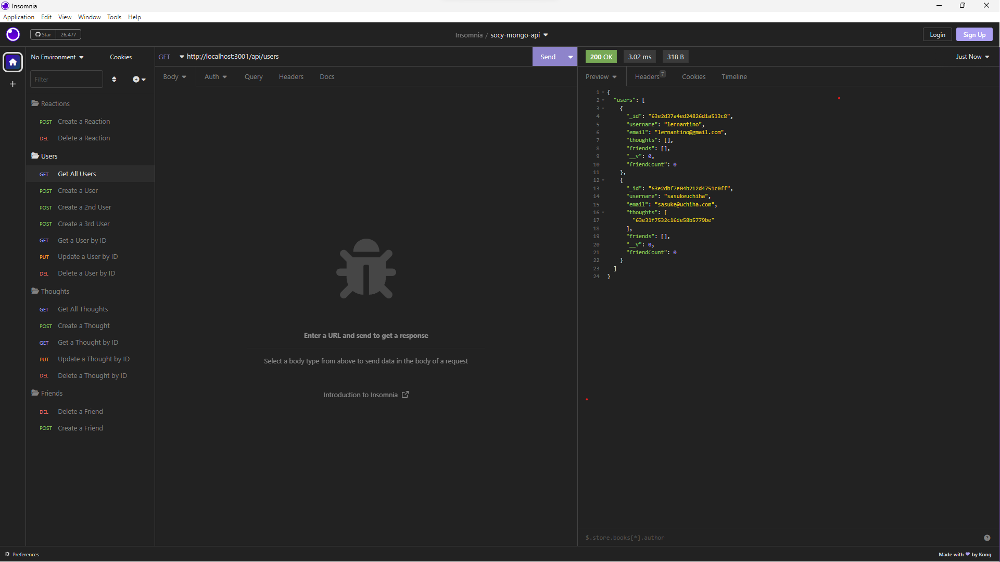

# socy-mongo-api

[Link to my project](https://github.com/Deiontre10/socy-mongo-api)
[Link to demo video](https://drive.google.com/file/d/115ugZgdog9n1-4UF9OwRQSwOFrUHD4UU/view)

## Table of Contents
- [Description](#description)
- [Visuals](#visuals)

## Description

The Socy API is a RESTful API that provides access to a NoSQL database for social network data storage and retrieval. This API allows clients to create, get, update and delete user profiles, post updates and manage friend connections, enabling the development of social network applications. It leverages the scalability and flexibility of NoSQL databases to handle large amounts of dynamic and unstructured data.

## Visuals

